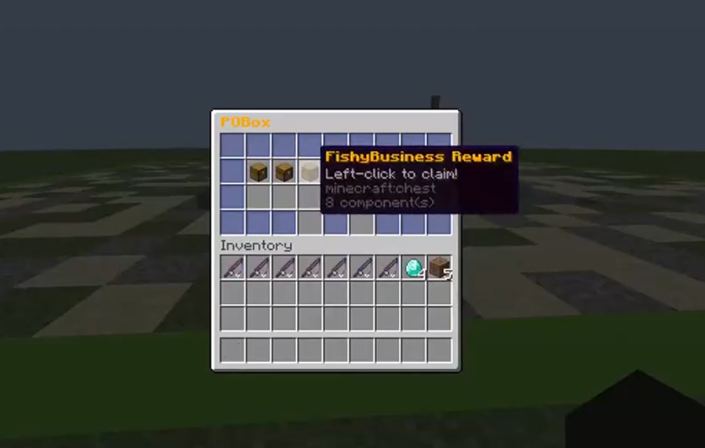

# POBox



POBox is a minecraft plugin that allows you to stash items and other things in
virtual storage so that player can collect them later. Offline players aren't
supported yet.

Other plugins can hook onto POBox to send mail or even implement their own mail
types. You can check example usage in my other plugin,
FishyBusiness, [here](https://github.com/KaspianDev/FishyBusiness).

## Commands:

- /pobox send <player\> <name\> <type\> ... - Send mail to an online player
- /pobox - Opens your own box

## Permissions:

- pobox.command.send
- pobox.open - Allowed by default

## Using POBox as dependency

Add jitpack repository to your project.

Gradle:

```groovy
maven { url = "https://jitpack.io" }
```

Maven:

```xml

<repository>
    <id>jitpack.io</id>
    <url>https://jitpack.io</url>
</repository>
```

Add the plugin as dependency.

Gradle:

```groovy
compileOnly "com.github.KaspianDev:POBox:master-SNAPSHOT"
```

Maven:

```xml

<dependency>
    <groupId>com.github.KaspianDev</groupId>
    <artifactId>POBox</artifactId>
    <version>master-SNAPSHOT</version>
</dependency>
```

Add the plugin to `depend` or `softdepend` in `plugin.yml`.

```yml
depend: [ POBox ]
```

The API currently only contains 2 events:

- `MailClaimEvent` - Triggers when player tries to claim mail. Cancelling it
  will prevent player from claiming.
- `MailSendEvent` - Triggers when mail is sent to a player. Cancelling it will
  stop mail from being sent.

You can implement your own Mail by extending Mail abstract class. Check
CommandMail and ItemMail for examples. Mail must support java serialization.

Mail can have an optional icon that will override the icon from config file.  
Example command with and without icon:

```java
CommandMail withIcon = new CommandMail("name", "command", Material.STICK);
CommandMail withoutIcon = new CommandMail("name", "command");
```

To send mail you can access MailManager like so:

```
POBox poBox = (POBox) Bukkit.getPluginManager().getPlugin("POBox");
MailManager mailManager = poBox.getMailManager();
mailManager.getBox(player).ifPresent((box) -> {
    mailManager.sendMail(box, ...);
});
```

## Building:

```sh
git clone https://github.com/KaspianDev/POBox.git
```

```sh
./gradlew build
```

Artifact will be located in build/libs.
